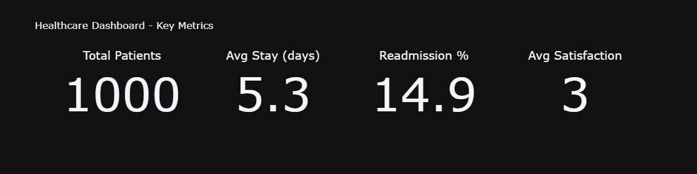
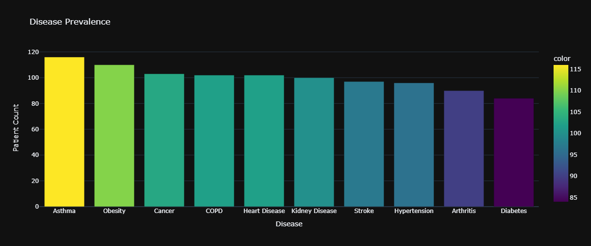
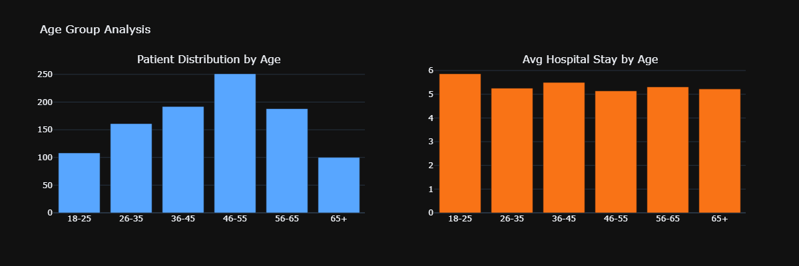
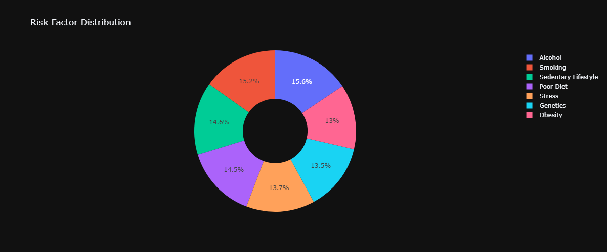
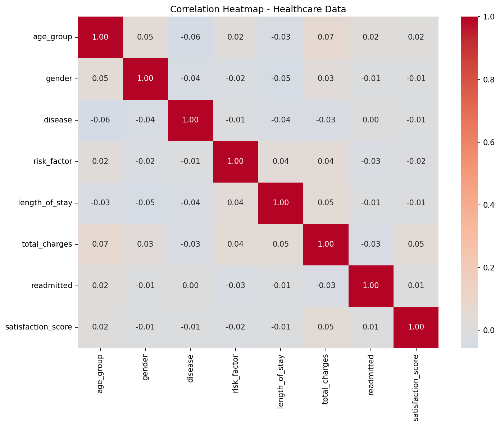

# Healthcare Analytics Dashboard


## Overview

An interactive Streamlit web application for analyzing hospital and patient data. Visualizes disease prevalence, age-group demographics, risk factor distributions, hospital utilization trends, and department-level performance metrics. Features 8 visualization sections with real-time filtering and KPI updates.

---

## Table of Contents

- [Features](#features)
- [Tech Stack](#tech-stack)
- [Project Structure](#project-structure)
- [Prerequisites](#prerequisites)
- [Installation](#installation)
- [Usage](#usage)
- [Dashboard Sections](#dashboard-sections)
- [Data Schema](#data-schema)
- [Visualizations](#visualizations)
- [Screenshots](#screenshots)
- [Performance](#performance)
- [Contributing](#contributing)
- [License](#license)

---

## Features

### Interactive Dashboard
- **8 Visualization Sections** - Comprehensive hospital analytics
- **Real-Time Filtering** - Dynamic disease and age group selection
- **KPI Metrics** - Total patients, avg stay, readmission rate, satisfaction
- **Responsive Design** - Works on desktop and mobile

### Visualizations
1. **Disease Prevalence** - Bar chart showing patient count per disease
2. **Age Group Analysis** - Dual subplots for distribution and hospital stay
3. **Risk Factor Distribution** - Donut chart of risk factors
4. **Hospital Utilization Trends** - 2x2 grid with monthly metrics
5. **Risk Factor Correlation** - Heatmap analyzing 8 encoded variables
6. **Department Utilization** - Bar chart with cost-based coloring
7. **Disease by Age Group** - Cross-tabulation heatmap
8. **Gender Distribution** - Grouped bar chart by disease

### Data Generation
- **Synthetic Data** - 1,000 patient records with 11 fields
- **Monthly Trends** - 12 months of aggregated metrics
- **Reproducible** - Seeded random generators for consistency

---

## Tech Stack

| Category | Technology |
|----------|------------|
| **Language** | Python 3.8+ |
| **Web Framework** | Streamlit 1.32+ |
| **Data Processing** | Pandas 2.0+, NumPy 1.24+ |
| **Visualization** | Plotly 5.18+, Matplotlib 3.7+, Seaborn 0.12+ |
| **Data Source** | Synthetic (generate_data.py) |

---

## Project Structure

```
healthcare-dashboard/
├── app.py                      # Main Streamlit dashboard (175 lines)
├── generate_data.py            # Synthetic data generation (55 lines)
├── requirements.txt            # Python dependencies
├── patient_data.csv            # Generated: 1,000 patient records
├── monthly_trends.csv          # Generated: 12 monthly records
├── README.md
└── .vscode/
    ├── settings.json           # VS Code configuration
    ├── extensions.json         # Recommended extensions
    ├── launch.json             # Debug configurations
    └── tasks.json              # Task definitions
```

---

## Prerequisites

### Required Software

| Software | Version | Download |
|----------|---------|----------|
| **Python** | 3.8 or higher | [Download](https://www.python.org/downloads/) |
| **pip** | Latest | Comes with Python |
| **Git** | Any version | [Download](https://git-scm.com/) |

### System Requirements

- **OS:** Windows 10/11, macOS, or Linux
- **RAM:** 4 GB minimum
- **Disk Space:** 200 MB for dependencies
- **Browser:** Chrome, Firefox, or Edge

---

## Installation

### 1. Clone the Repository

```bash
git clone https://github.com/Asmit1434/healthcare-dashboard.git
cd healthcare-dashboard
```

### 2. Create Virtual Environment (Recommended)

```bash
# Create virtual environment
python -m venv venv

# Activate virtual environment
# On Windows:
venv\Scripts\activate

# On macOS/Linux:
source venv/bin/activate
```

### 3. Install Dependencies

```bash
pip install -r requirements.txt
```

**Requirements:**
```
streamlit>=1.32.0
pandas>=2.0.0
numpy>=1.24.0
plotly>=5.18.0
matplotlib>=3.7.0
seaborn>=0.12.0
```

### 4. Verify Installation

```bash
python -c "import streamlit, pandas, plotly; print('All dependencies installed successfully!')"
```

---

## Usage

### Running the Dashboard

```bash
streamlit run app.py
```

This will:
1. Start the Streamlit server
2. Open your default browser to `http://localhost:8501`
3. Display the interactive dashboard

### Generating Sample Data

To regenerate the synthetic data:

```bash
python generate_data.py
```

This creates:
- `patient_data.csv` (1,000 records)
- `monthly_trends.csv` (12 records)

### Using VS Code

1. Open the project folder in VS Code
2. Install recommended extensions (Python, Streamlit)
3. Press `F5` or use the Run and Debug panel
4. Select "Run Streamlit App" configuration

---

## Dashboard Sections

### 1. Sidebar Filters
- **Disease Multiselect** - Filter by specific diseases (default: first 3)
- **Age Group Multiselect** - Filter by age brackets (default: all)
- Filters dynamically update all charts and metrics

### 2. Top-Level KPI Metrics
| Metric | Description |
|--------|-------------|
| **Total Patients** | Count of filtered records |
| **Avg Length of Stay** | Mean hospital stay in days |
| **Readmission Rate** | Percentage of patients readmitted |
| **Avg Satisfaction** | Mean satisfaction score (1-5) |

### 3. Disease Prevalence
- **Chart Type:** Bar chart (Plotly)
- **X-axis:** Disease names
- **Y-axis:** Patient count
- **Color:** Gradient by count

### 4. Age Group Analysis
- **Chart Type:** Dual subplots (Plotly)
- **Left:** Patient distribution by age group
- **Right:** Average hospital stay by age group
- **Age Groups:** 18-25, 26-35, 36-45, 46-55, 56-65, 65+

### 5. Risk Factor Distribution
- **Chart Type:** Donut chart (Plotly)
- **Categories:** Smoking, Obesity, Sedentary Lifestyle, Poor Diet, Alcohol, Stress, Genetics, None
- **Colors:** Qualitative Set2 palette

### 6. Hospital Utilization Trends
- **Chart Type:** 2x2 subplot grid (Plotly)
- **Metrics:**
  - Monthly admissions (Poisson-distributed, ~800/month)
  - Average length of stay (normal, mean 5.5 days)
  - Readmission rate (%)
  - Total charges (in millions)

### 7. Risk Factor Correlation Analysis
- **Chart Type:** Heatmap (Seaborn/Matplotlib)
- **Variables:** Age, Risk Factor, Disease, Gender, Length of Stay, Total Charges, Readmitted, Satisfaction Score
- **Color Map:** Coolwarm (centered at 0)

### 8. Department Utilization
- **Chart Type:** Bar chart (Plotly)
- **X-axis:** Hospital departments
- **Y-axis:** Patient count
- **Color:** Total charges (Viridis scale)
- **Departments:** Cardiology, Neurology, Oncology, Pulmonology, Nephrology, Orthopedics, General

### 9. Disease by Age Group
- **Chart Type:** Cross-tabulation heatmap (Seaborn)
- **Color Map:** YlOrRd
- **Values:** Integer annotations

### 10. Gender Distribution by Disease
- **Chart Type:** Grouped bar chart (Plotly)
- **Groups:** Male (blue), Female (red)
- **X-axis:** Diseases

### 11. Cost Analysis by Disease
- **Chart Type:** Bubble chart (Plotly)
- **X-axis:** Average cost
- **Y-axis:** Average length of stay
- **Bubble Size:** Cost standard deviation
- **Hover:** Median cost

---

## Data Schema

### Patient Dataset (`patient_data.csv`)

| Column | Type | Description | Values/Range |
|--------|------|-------------|--------------|
| `patient_id` | int | Unique identifier | 1-1000 |
| `age_group` | str | Age bracket | 18-25, 26-35, 36-45, 46-55, 56-65, 65+ |
| `gender` | str | Gender | Male, Female (50/50 split) |
| `disease` | str | Diagnosis | 10 diseases |
| `risk_factor` | str | Risk factor | 8 categories |
| `department` | str | Hospital department | 7 departments |
| `admission_date` | str | Date of admission | All dates in 2024 |
| `length_of_stay` | int | Hospital stay (days) | Exponential dist (lambda=5) |
| `total_charges` | float | Cost in USD | Normal (mean=$15K, std=$5K) |
| `readmitted` | int | Readmission flag | 0 (85%) or 1 (15%) |
| `satisfaction_score` | int | Patient satisfaction | 1-5 (uniform) |

### Diseases Included
1. Diabetes
2. Hypertension
3. Heart Disease
4. Asthma
5. Obesity
6. Cancer
7. Stroke
8. Kidney Disease
9. COPD
10. Arthritis

### Risk Factors
1. Smoking
2. Obesity
3. Sedentary Lifestyle
4. Poor Diet
5. Alcohol
6. Stress
7. Genetics
8. None

### Hospital Departments
1. Cardiology
2. Neurology
3. Oncology
4. Pulmonology
5. Nephrology
6. Orthopedics
7. General

### Age Group Distribution
| Age Group | Probability |
|-----------|-------------|
| 18-25 | 10% |
| 26-35 | 15% |
| 36-45 | 20% |
| 46-55 | 25% |
| 56-65 | 20% |
| 65+ | 10% |

---

## Visualizations

### 1. Disease Prevalence Bar Chart
Shows patient count for each disease, helping identify most common conditions.

### 2. Age Group Analysis
Dual view showing which age groups have most patients and their average hospital stay duration.

### 3. Risk Factor Donut Chart
Visual breakdown of risk factors across the patient population.

### 4. Hospital Utilization Trends
Four metrics tracked over 12 months showing seasonal patterns and trends.

### 5. Correlation Heatmap
Identifies relationships between variables (e.g., age vs. length of stay, risk factors vs. readmission).

### 6. Department Utilization
Shows which departments handle most patients and their associated costs.

### 7. Disease by Age Heatmap
Cross-tabulation showing which diseases affect which age groups most.

### 8. Gender Distribution
Compares disease prevalence between male and female patients.

### 9. Cost vs. Stay Bubble Chart
Analyzes relationship between treatment cost and hospital stay length by disease.

---

## Screenshots

### Dashboard Overview - Key Metrics


### Disease Prevalence Analysis


### Age Group Analysis


### Risk Factor Distribution


### Correlation Heatmap


---

## Performance

| Metric | Value |
|--------|-------|
| Data Generation | < 1 second |
| Dashboard Load | < 3 seconds |
| Filter Update | < 500ms |
| Chart Rendering | < 200ms |
| Data Caching | @st.cache_data |

---

## Customization

### Changing Data Sources

To use real data instead of synthetic:

1. Replace `generate_data.py` with your data loader
2. Ensure the CSV has the same column structure
3. Update `app.py` to read from your data source

### Adding New Visualizations

1. Create a new function in `app.py`
2. Use Plotly Express for interactive charts
3. Add to the main dashboard layout

### Modifying Colors

Edit the color palettes in the Plotly chart configurations:
- `color_continuous_scale` for heatmaps
- `color_discrete_map` for categorical data

---

## Contributing

Contributions are welcome! Please follow these steps:

1. Fork the repository
2. Create a feature branch (`git checkout -b feature/amazing-feature`)
3. Commit your changes (`git commit -m 'Add amazing feature'`)
4. Push to the branch (`git push origin feature/amazing-feature`)
5. Open a Pull Request

**Guidelines:**
- Follow PEP 8 style guide
- Add docstrings to new functions
- Update README if needed
- Test before submitting PR

---

## License

This project is licensed under the MIT License - see the [LICENSE](LICENSE) file for details.

---

## Author

**Asmit Singh**
- LinkedIn: [linkedin.com/in/asmit-singh-dev](https://linkedin.com/in/asmit-singh-dev)
- GitHub: [github.com/Asmit1434](https://github.com/Asmit1434)

---

## Acknowledgments

- [Streamlit](https://streamlit.io/) for the amazing web framework
- [Plotly](https://plotly.com/python/) for interactive visualizations
- [Pandas](https://pandas.pydata.org/) for data manipulation
- [NumPy](https://numpy.org/) for numerical computing
